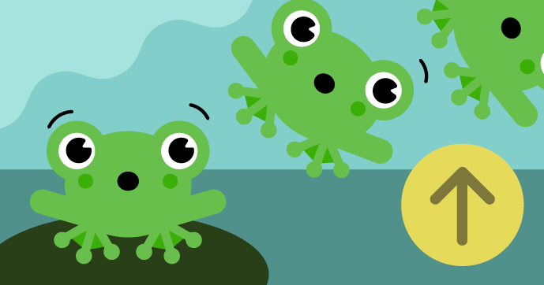

# Hop the Frog

Make a cartoon frog that jumps, stretches, and squashes as it hops through your code.

Find the project online at [projects.raspberrypi.org/en/projects/python-wild-hop-the-frog](https://projects.raspberrypi.org/en/projects/python-wild-hop-the-frog)

## Resources
For project materials and solutions, see [en/resources](https://github.com/raspberrypilearning/python-wild-hop-the-frog/tree/master/en/resources) and [en/solutions](https://github.com/raspberrypilearning/python-wild-hop-the-frog/tree/master/en/solutions).

## Contributing
See [CONTRIBUTING.md](CONTRIBUTING.md)

## Licence
See [LICENCE.md](LICENCE.md)
