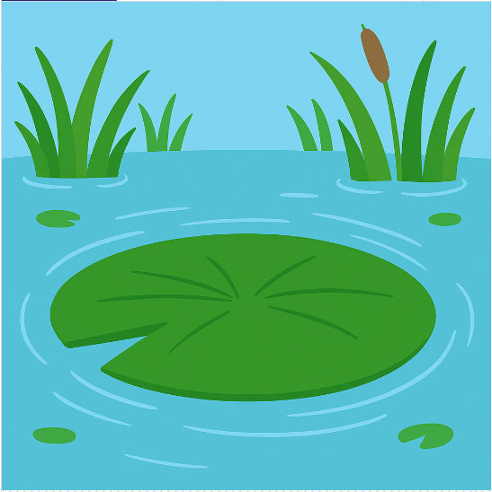

<h2 class="c-project-heading--task">Add a background</h2>
--- task ---
Add an image that fills the screen with a pond background.
--- /task ---

<h2 class="c-project-heading--explainer">Set the scene</h2>

Let’s start by adding a pond background to your screen. 🐸  
You’ll use `load_image()` to load a picture and `image()` to draw it each frame.

The image is already provided and saved as **`background.png`** in the same folder as your code.

--- code ---
---
language: python
filename: main.py
line_numbers: true
line_number_start: 1
line_highlights: 10, 17
---
from p5 import *

x = 200
y = 200
speed = 0
gravity = 1
jumping = False

def setup():
    size(400, 400)
    global bg
    bg = load_image('background.png')
    no_stroke()

def draw():
    image(bg, 0, 0, width, height)
--- /code ---

### Tip

The `image()` function places the image at a position.  
To fill the screen, pass in `0, 0, width, height`.

### Debugging

If the background doesn’t appear: 
- Make sure `load_image('background.png')` is inside `setup()` 
- Double-check the spelling of the file name 
- Use `image(bg, 0, 0, width, height)` in `draw()`

