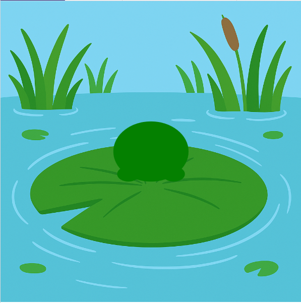

<h2 class="c-project-heading--task">Draw the frog</h2>
--- task ---
Use ellipses to draw the frog’s body and feet. 🐸👣
--- /task ---

<h2 class="c-project-heading--explainer">Draw the body and feet</h2>

Your frog needs a body and feet!  
You’ll use `ellipse()` to draw ovals. 🥚

The `ellipse()` function takes **4 arguments**:
- x position
- y position
- width
- height

Each part of the frog is placed **relative to `x` and `y`**.  
This will make it easy to animate later on.

--- code ---
---
language: python
filename: main.py
line_numbers: true
line_number_start: 16
line_highlights: 20-23
---
def draw():
    image(bg, 0, 0, width, height)
    
    # Draw Frog here
    fill('green')
    ellipse(x, y, 100, 80)               # body
    ellipse(x - 30, y + 30, 30, 20)      # left foot
    ellipse(x + 30, y + 30, 30, 20)      # right foot
--- /code ---

### Tip

Try changing the numbers to see how the shapes move!   
Notice how each part is drawn **after** the background — otherwise it would be hidden.

