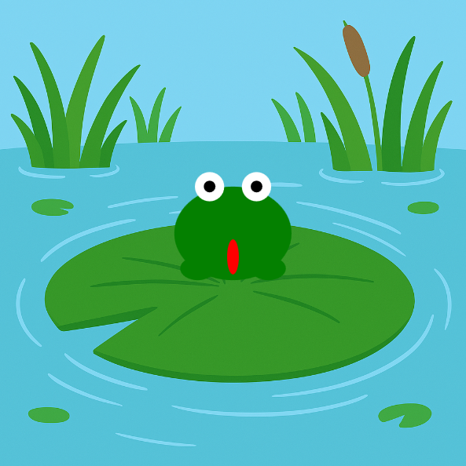

<h2 class="c-project-heading--task">Draw the eyes and tongue</h2>
--- task ---
Add white eyes with black pupils, and a red tongue underneath the frog.
--- /task ---

<h2 class="c-project-heading--explainer">Add some character</h2>

Let’s make your frog more expressive by adding two white eyes, black pupils, and a red tongue. 👀👅

Use `circle(x, y, size)` for the eyes and pupils — circles are just a simpler version of ellipses.

--- code ---
---
language: python
filename: main.py
line_numbers: true
line_number_start: 23
line_highlights: 32-34, 36-38, 40-41
---
def draw():
    image(bg, 0, 0, width, height)
    # Draw Frog here

    fill('green')
    ellipse(x, y, 100, 80)               # body
    ellipse(x - 30, y + 30, 30, 20)      # left foot
    ellipse(x + 30, y + 30, 30, 20)      # right foot

    fill('white')
    circle(x - 20, y - 40, 25)           # left eye
    circle(x + 20, y - 40, 25)           # right eye

    fill('black')
    circle(x - 20, y - 40, 10)           # left pupil
    circle(x + 20, y - 40, 10)           # right pupil

    fill('red')
    ellipse(x, y + 20, 10, 30)           # tongue
--- /code ---

### Tip

Try changing the size of the eyes or tongue!    
What happens if you move the pupils closer together or further apart?

### Debugging

If your eyes or tongue aren’t showing: 
- Make sure each shape has the right number of values 
- Use `fill()` before drawing each part 
- Check for typos in `circle()` and `ellipse()`

