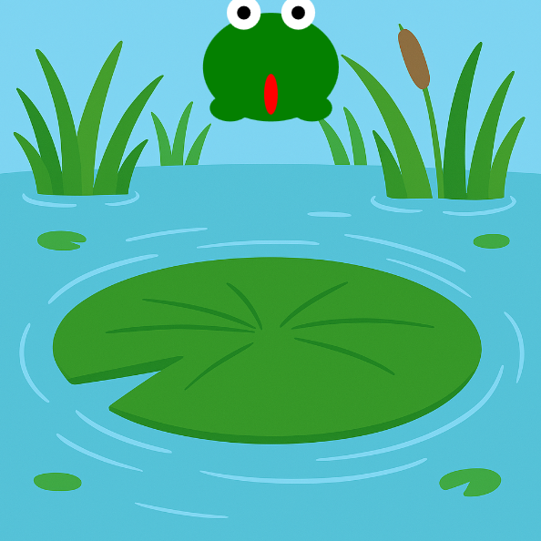

<h2 class="c-project-heading--task">Make the frog jump up</h2>
--- task ---
Use a variable to move the frog upwards when you click the mouse. 🖱️⬆️
--- /task ---

<h2 class="c-project-heading--explainer">Time to hop!</h2>

Let’s get your frog moving! 🐸💨  
You’ll make it jump upwards when the mouse is clicked.

We use a variable called `jumping` to keep track of whether the frog is in the air.  
- When you click, we set `jumping = True`  
- While `jumping` is `True`, the frog moves up using a `speed` value

To make the frog leap, we give it a small negative `speed` like `-15`.  
This makes the `y` position go up — remember, in code, smaller `y` means higher up on the screen! 🎯

--- code ---
---
language: python
filename: main.py
line_numbers: true
line_number_start: 1
line_highlights: 11-12, 29-30
---
from p5 import *

x = 200
y = 200
speed = 0
gravity = 1
jumping = False

def mouse_pressed():
    global jumping, speed
    if not jumping:
        jumping = True
        speed = -15

def setup():
    size(400, 400)
    global bg
    bg = load_image('background.png')
    no_stroke()

def draw():
    global y, speed, jumping
    image(bg, 0, 0, width, height)
    fill('green')
    ellipse(x, y, 100, 80)               # body
    ellipse(x - 30, y + 30, 30, 20)      # left foot
    ellipse(x + 30, y + 30, 30, 20)      # right foot

    fill('white')
    circle(x - 20, y - 40, 25)           # left eye
    circle(x + 20, y - 40, 25)           # right eye

    fill('black')
    circle(x - 20, y - 40, 10)           # left pupil
    circle(x + 20, y - 40, 10)           # right pupil

    fill('red')
    ellipse(x, y + 20, 10, 30)           # tongue

    if jumping:
        y += speed
--- /code ---

### Tip 🧠

Try changing the `speed` to `-10` or `-20` and see how high the frog jumps.  
Lower numbers = smaller jumps. Higher numbers = big hops! 🐸🚀

### Debugging 🛠️

If your frog doesn’t move: 
- Make sure `mouse_pressed()` is spelled correctly 
- Check that `jumping = True` and `speed = -15` are set 
- Look for `y += speed` inside the `if jumping:` block

