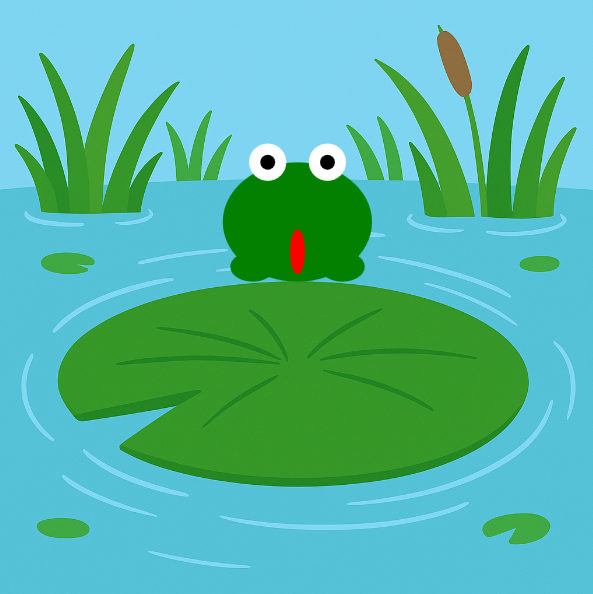

<h2 class="c-project-heading--task">Make the frog fall back down</h2>
--- task ---
Use gravity to bring your frog back to the ground after it jumps. 🪂
--- /task ---

<h2 class="c-project-heading--explainer">Falling with style</h2>

Right now, your frog jumps up and stays there. Let’s bring it back down to earth! 🌍  
We’ll use gravity to pull it down over time and land it safely.

Here’s how it works:  
- While `jumping` is `True`, we add `gravity` to `speed`  
- This makes the frog slow down, then fall faster and faster  
- When the frog reaches the ground, we reset its position and stop the jump

--- code ---
---
language: python
filename: main.py
line_numbers: true
line_number_start: 1
line_highlights: 31-35
---
from p5 import *

x = 200
y = 200
speed = 0
gravity = 1
jumping = False

def mouse_pressed():
    global jumping, speed
    if not jumping:
        jumping = True
        speed = -15

def setup():
    size(400, 400)
    global bg
    bg = load_image('background.png')
    no_stroke()

def draw():
    global y, speed, jumping
    image(bg, 0, 0, width, height)
    fill('green')
    ellipse(x, y, 100, 80)               # body
    ellipse(x - 30, y + 30, 30, 20)      # left foot
    ellipse(x + 30, y + 30, 30, 20)      # right foot

    fill('white')
    circle(x - 20, y - 40, 25)           # left eye
    circle(x + 20, y - 40, 25)           # right eye

    fill('black')
    circle(x - 20, y - 40, 10)           # left pupil
    circle(x + 20, y - 40, 10)           # right pupil

    fill('red')
    ellipse(x, y + 20, 10, 30)           # tongue

    if jumping:
        y += speed
        speed += gravity
        if y >= 200:
            y = 200
            speed = 0
            jumping = False
--- /code ---

### Tip 🌟

Try increasing or decreasing the `gravity` value to see how it affects your frog’s fall.  
Higher numbers = faster landing. Lower numbers = slower fall. 🐸⬇️

### Debugging 🧰

If your frog never lands: 
- Make sure `speed += gravity` is inside `if jumping:` 
- Did you check that `y >= 200`? 
- Be sure to reset `speed = 0` and `jumping = False`

