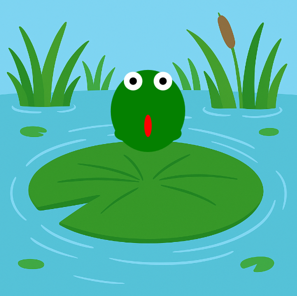

<h2 class="c-project-heading--task">Stretch the frog</h2>
--- task ---
Stretch your frog’s body when it’s in the air. 🐸📏
--- /task ---

<h2 class="c-project-heading--explainer">Leaping taller</h2>

When a frog jumps, it stretches its body to look like it's really pushing off the ground.  
We can use a variable to make the body longer while the frog is in the air.

We’ll create a `stretch` variable and add it to the frog’s height when `jumping = True`.

--- code ---
---
language: python
filename: main.py
line_numbers: true
line_number_start: 23
line_highlights: 26, 30
---
def draw():
    global y, speed, jumping
    image(bg, 0, 0, width, height)
    stretch = 30 if jumping else 0
    
    # Draw Frog here
    fill('green')
    ellipse(x, y, 100, 80 + stretch)     # body
--- /code ---

### Tip

Try changing the `30` to `20` or `40` to adjust the stretch.  
You can even change the value while jumping to make the stretch more dramatic! 🎭

### Debugging

If your frog doesn’t stretch: 
- Check that `stretch = 30 if jumping else 0` comes before the `ellipse()` 
- Make sure you’re using `80 + stretch` for the body height

