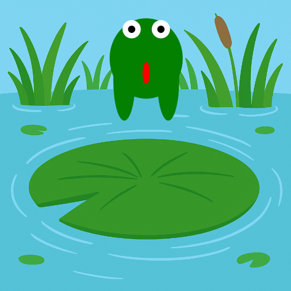

<h2 class="c-project-heading--task">Stretch the frog’s legs</h2>
--- task ---
Make the frog’s feet stretch as it jumps. 🐾
--- /task ---

<h2 class="c-project-heading--explainer">Push off with power!</h2>

Now let’s stretch the frog’s legs as it jumps.  
We’ll change the **height** of the feet using the same `stretch` variable.

Multiply the `stretch` by a number to exaggerate the leg movement.  
Try `stretch * 2` or `stretch * 3`!

--- code ---
---
language: python
filename: main.py
line_numbers: true
line_number_start: 23
line_highlights: 31-32
---
def draw():
    global y, speed, jumping
    image(bg, 0, 0, width, height)
    fill('green')

    stretch = 30 if jumping else 0

    ellipse(x, y, 100, 80 + stretch)                     # body
    ellipse(x - 30, y + 30, 30, 20 + stretch * 3)        # left leg
    ellipse(x + 30, y + 30, 30, 20 + stretch * 3)        # right leg
--- /code ---

### Tip

If the legs stretch too much, try multiplying by a smaller number.  
Stretching by `stretch * 2` will look gentler than `stretch * 3`.

### Debugging

If the feet look wrong: 
- Make sure you're adding `stretch * 3` to the **height** of each foot 
- Double-check the position of the legs is still `x - 30` and `x + 30`

