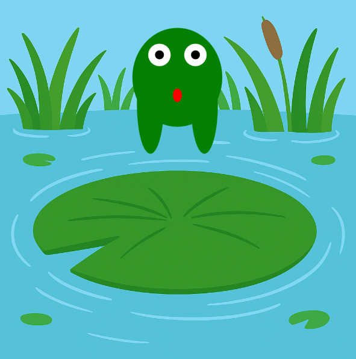

<h2 class="c-project-heading--task">Stretch the eyes and tongue</h2>
--- task ---
Make the frog’s eyes rise and its tongue shrink when it jumps! 👀👅
--- /task ---

<h2 class="c-project-heading--explainer">Finishing touches</h2>

Let’s stretch the eyes so they rise during a jump, and shrink the tongue to make it look like it’s pulling up from the lily pad.

Use the same `stretch` variable to change the `y` positions and height.  
This adds polish to the animation! ✨

--- code ---
---
language: python
filename: main.py
line_numbers: true
line_number_start: 34
line_highlights: 35-36, 39-40, 43
---
    fill('white')
    circle(x - 20, y - 40 + stretch / 2, 25)   # left eye
    circle(x + 20, y - 40 + stretch / 2, 25)   # right eye

    fill('black')
    circle(x - 20, y - 40 + stretch / 2, 10)   # left pupil
    circle(x + 20, y - 40 + stretch / 2, 10)   # right pupil

    fill('red')
    ellipse(x, y + 20, 10, 30 - stretch / 2)   # tongue
--- /code ---

### Tip

Adding or subtracting part of `stretch` from the eye or tongue position will animate them.  
Smaller stretch = lower eyes and longer tongue.  
Bigger stretch = higher eyes and a shorter tongue!

### Debugging

If the eyes or tongue look strange: 
- Double-check the `+ stretch / 2` or `- stretch / 2` parts 
- Make sure you update both the white and black circles for each eye 

### Feedback

This is a beta projects, which means it is brand new and not widely available. If you've tested this project on your own or with your club, let us know what you think.

<a href="https://form.raspberrypi.org/4874054?tfa_6933=python-wild-hop-the-frog" style="
  display: inline-block;
  padding: 10px 20px;
  border: 2px solid black;
  border-radius: 999px;
  font-weight: bold;
  font-size: 16px;
  background-color: white;
  color: black;
  text-align: center;
  text-decoration: none;
  transition: background-color 0.2s;
" onmouseover="this.style.backgroundColor='#f0f0f0';" onmouseout="this.style.backgroundColor='white';">
  Give feedback
</a>

