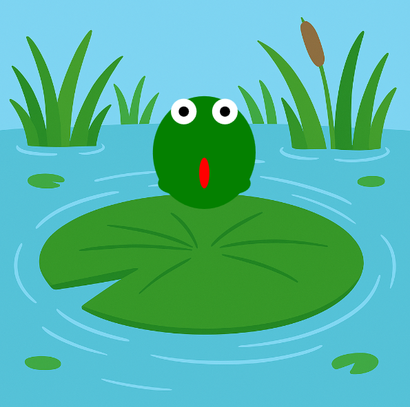

<h2 class="c-project-heading--task">Étirer la grenouille</h2>

--- task ---

Étire le corps de ta grenouille lorsqu'elle est en l'air. 🐸📏

--- /task ---

<h2 class="c-project-heading--explainer">Sauter plus haut</h2>

Lorsqu'une grenouille saute, elle étire son corps pour donner l'impression qu'elle prend réellement appui sur le sol.  
On peut utiliser une variable pour allonger le corps lorsque la grenouille est en l'air.

Nous allons créer une variable `etirement` et l'ajouter à la hauteur de la grenouille lorsque `sauter = True`.

<div class="c-project-code">
--- code ---
---
language: python
filename: main.py
line_numbers: true
line_number_start: 23
line_highlights: 26, 30
---

def draw():
global y, vitesse, sauter
image(bg, 0, 0, width, height)
etriement = 30 if sauter else 0

    ```
    # Dessiner la grenouille ici
    fill('green')
    ellipse(x, y, 100, 80 + etirement) # corps
    ```

--- /code ---

</div>

<div class="c-project-output">

</div>

<div class="c-project-callout c-project-callout--tip">

### Astuce

Essaie de remplacer `30` par `20` ou `40` pour ajuster l'étirement. <br />
Tu peux même modifier la valeur pendant le saut pour rendre l'étirement plus spectaculaire ! 🎭

</div>

<div class="c-project-callout c-project-callout--debug">

### Déboguer

Si ta grenouille ne s'étire pas :<br />

- Vérifie que `etrirement = 30 if sauter else 0` précède `ellipse()`<br />
- Assure-toi d'ajouter de l'étirement à la hauteur du corps

</div>