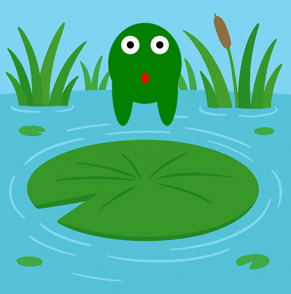

<h2 class="c-project-heading--task">Étirer les yeux et la langue</h2>

--- task ---

Fais lever les yeux de la grenouille et rétracter sa langue lorsqu'elle saute ! 👀👅

--- /task ---

<h2 class="c-project-heading--explainer">Touches finales</h2>

Allons étirer les yeux pour qu'ils se lèvent pendant un saut, et rétrécissons la langue pour donner l'impression qu'elle se soulève du nénuphar.

Utilise la même variable `etirement` pour modifier les positions et la hauteur `y`.  
Cela donne une touche finale à l'animation ! ✨

--- code ---
---
language: python
filename: main.py
line_numbers: true
line_number_start: 34
line_highlights: 35-36, 39-40, 43
---

    fill('white')
    circle(x - 20, y - 40 + etirement / 2, 25)   # oeil gauche
    circle(x + 20, y - 40 + etirement / 2, 25)   # oeil droit
    
    fill('black')
    circle(x - 20, y - 40 + etirement / 2, 10)   # pupille gauche
    circle(x + 20, y - 40 + etirement / 2, 10)   # pupille droite
    
    fill('red')
    ellipse(x, y + 20, 10, 30 - etirement / 2)   # langue

--- /code ---

### Astuce

Ajouter ou soustraire une partie de l'effet « étirement » à la position des yeux ou de la langue les animera.  
Étirement plus petit = yeux plus bas et langue plus longue.  
Plus l'étirement est grand = yeux plus hauts et langue plus courte !

### Déboguer

Si les yeux ou la langue ont une apparence étrange : 

- Vérifie bien les parties `+ etirement / 2` ou `- etirement / 2` 
- Assure-toi de mettre à jour les cercles blancs et noirs pour chaque œil 

### Avis

Il s'agit d'un projet bêta, ce qui signifie qu'il est tout nouveau et pas encore largement disponible. Si tu as testé ce projet individuellement ou avec ton club, n'hésite pas à nous faire part de ton avis.

<a href="https://form.raspberrypi.org/4874054?tfa_6933=python-wild-hop-the-frog" style="
    display: inline-block;
    padding: 10px 20px;
    border: 2px solid black;
    border-radius: 999px;
    font-weight: bold;
    font-size: 16px;
    background-color: white;
    color: black;
    text-align: center;
    text-decoration: none;
    transition: background-color 0.2s;
" onmouseover="this.style.backgroundColor='#f0f0f0';" onmouseout="this.style.backgroundColor='white';">
Donner ton avis </a>

***

Ce projet a été traduit par des bénévoles:

Michel Arnols

Jonathan Vannieuwkerke

Grâce aux bénévoles, nous pouvons donner aux gens du monde entier la chance d'apprendre dans leur propre langue. Vous pouvez nous aider à atteindre plus de personnes en vous portant volontaire pour la traduction - plus d'informations sur [rpf.io/translate](https://rpf.io/translate).
