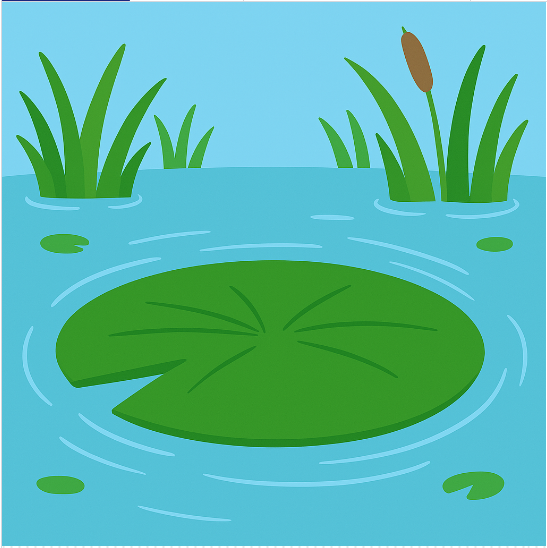

<h2 class="c-project-heading--task">Додай фон</h2>

\--- task ---

Додай зображення, яке заповнить екран фоном ставка. 🐸🌿

\--- /task ---

<h2 class="c-project-heading--explainer">Створюємо сцену</h2>

Давай почнемо з додавання фону ставка на твій екран.  
Ти будеш використовувати `load_image()`, щоб завантажити зображення, і `image()`, щоб малювати його кожен кадр.

Зображення вже є та збережене як **`background.png`** у тій же папці, що й твій код.

<div class="c-project-code">
--- code ---
---
language: python
filename: main.py
line_numbers: true
line_number_start: 1
line_highlights: 12-13, 17
---

from p5 import \*

x = 200 # horizontal middle
y = 200 # vertical middle
speed = 0
gravity = 1
jumping = False

def setup():
size(400, 400)
no_stroke()
global bg
bg = load_image('background.png')

def draw():
зображення(bg, 0, 0, ширина, висота)

    ```
    # Намалюй Жабку тут
    ```

run()

\--- /code ---

</div>

<div class="c-project-output">

</div>

<div class="c-project-callout c-project-callout--tip">

### Більше

Функція `image()` розміщує зображення у вказаній позиції.  <br />
Щоб заповнити екран, передай `0, 0, width, height`.

</div>

<div class="c-project-callout c-project-callout--debug">

### Налагодження

Якщо фон не з’являється:<br />

- `global bg` має бути у функції `setup()`. (bg — це фон)<br />
- Перевір, що 'background.png' у лапках.<br />
- Використовуй `image(bg, 0, 0, width, height)` у `draw()` (bg — це фон)

</div>
