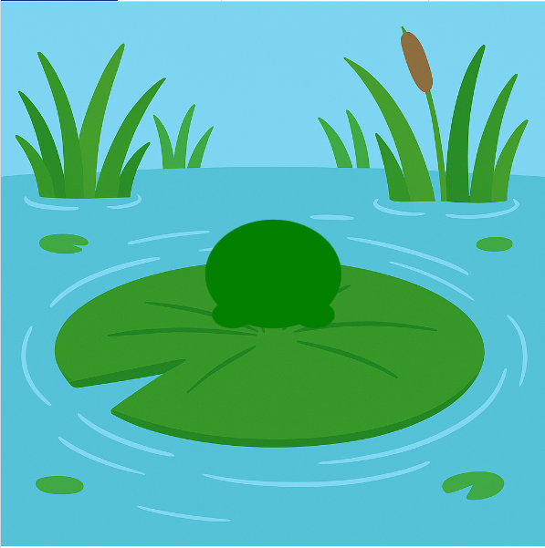

<h2 class="c-project-heading--task">Намалюй жабу</h2>

\--- task ---

Використовуй еліпси, щоб намалювати тулуб і лапи жаби. 🐸🦵

\--- /task ---

<h2 class="c-project-heading--explainer">Намалюй тулуб і лапи</h2>

Твоїй жабі потрібні тулуб і лапи!  
Використовуватимеш `ellipse()`, щоб малювати овали. 🥚

Функція `ellipse()` приймає **4 аргументи**:

- координата x
- координата y
- ширина
- висота

Кожна частина жаби розташовується **відносно `x` та `y`**.  
Так буде легше анімувати все пізніше.

<div class="c-project-code">
--- code ---
---
language: python
filename: main.py
line_numbers: true
line_number_start: 16
line_highlights: 20-23
---

def draw():
зображення(bg, 0, 0, ширина, висота)

    ```
    # Намалюй жабу тут
    fill('green')
    ellipse(x, y, 100, 80)               # тулуб
    ellipse(x - 30, y + 30, 30, 20)      # ліва лапа
    ellipse(x + 30, y + 30, 30, 20)      # права лапа
    ```

\--- /code ---

</div>

<div class="c-project-output">

</div>

<div class="c-project-callout c-project-callout--tip">

### Порада

Спробуй змінити числа й подивися, як рухаються фігури!  <br />
Поміти, що кожна частина малюється **після** фону — інакше її не буде видно.

</div>