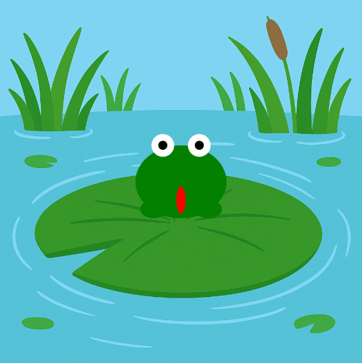

<h2 class="c-project-heading--task">Намалюй очі та язик жаби.</h2>

\--- task ---

Додай білі очі з чорними зіницями, а під жабкою — червоний язик.

\--- /task ---

<h2 class="c-project-heading--explainer">Додай трішки характеру</h2>

Давай зробимо твою жабу виразнішою: додамо два білі ока, чорні зіниці та червоний язик. 👀👅

Використовуй `circle(x, y, size)` для очей і зіниць — кола це простіша версія еліпсів.

<div class="c-project-code">
--- code ---
---
language: python
filename: main.py
line_numbers: true
line_number_start: 16
line_highlights: 25-27, 29-31, 33-34
---

def draw():
image(тло, 0, 0, ширина, height)
\# Намалюй жабку тут

    ```
    fill('green')
    ellipse(x, y, 100, 80)               # тулуб
    ellipse(x - 30, y + 30, 30, 20)      # ліва нога
    ellipse(x + 30, y + 30, 30, 20)      # права нога
    
    fill('white')
    circle(x - 20, y - 40, 25)           # ліве око
    circle(x + 20, y - 40, 25)           # праве око
    
    fill('black')
    circle(x - 20, y - 40, 10)           # ліва зіниця
    circle(x + 20, y - 40, 10)           # права зіниця
    
    fill('red')
    ellipse(x, y + 20, 10, 30)           # язик
    ```

\--- /code ---

</div>

<div class="c-project-output">

</div>

<div class="c-project-callout c-project-callout--tip">

### Порада

Спробуй змінити розмір очей або язика! <br />  
Що буде, якщо наблизити або віддалити зіниці одне від одного?

</div>

<div class="c-project-callout c-project-callout--debug">

### Налагодження

Якщо твої очі або язик не зʼявилися:<br />

- Переконайся, що для кожної фігури вказана правильна кількість значень<br />
- Використовуй `fill()` перед малюванням кожної частини<br />
- Перевір, чи немає помилок у написанні `circle()` та `ellipse()`

</div>