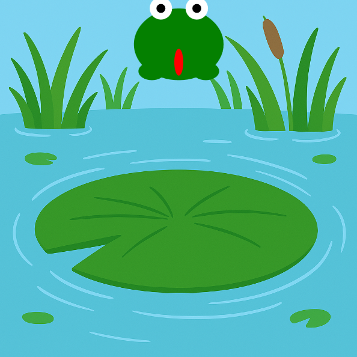

<h2 class="c-project-heading--task">Застав жабку підстрибнути вгору!</h2>

\--- task ---

Використовуй змінну, щоб підняти жабку вгору, коли натискаєш мишею. 🖱️⬆️

\--- /task ---

<h2 class="c-project-heading--explainer">Час стрибати!</h2>

Давай змусимо твою жабку рухатися! 🐸💨  
Ти примусиш її стрибати вгору, коли мишу буде натиснуто.

Використовуй змінну з назвою `jumping`, щоб відстежувати, чи знаходиться жабка у повітрі.

- Коли ти натискаєш (будь-де на екрані!), ми ставимо `jumping = True`
- Якщо `jumping` — це `True`, жабка рухається вгору з використанням значення `speed`

Щоб жабка підстрибнула, ми надаємо їй невелику негативну швидкість, наприклад `-15`.  
Це піднімає позицію `y` вгору — пам'ятай, у коді менше `y` означає вище на екрані!

<div class="c-project-code">
--- code ---
---
language: python
filename: main.py
line_numbers: true
line_number_start: 6
line_highlights: 9-13, 24, 44-45
---

gravity = 1
jumping = False

def mouse_pressed():
global jumping, speed
if not jumping:
jumping = True
speed = -15

def setup():
size(400, 400)
no_stroke()
global bg
bg = load_image('background.png')

def draw():
global y, speed, jumping
image(bg, 0, 0, width, height)

    ```
    # Малюємо жабку тут
    fill('green')
    ellipse(x, y, 100, 80)               # тіло
    ellipse(x - 30, y + 30, 30, 20)      # ліва нога
    ellipse(x + 30, y + 30, 30, 20)      # права нога
    
    fill('white')
    circle(x - 20, y - 40, 25)           # ліве око
    circle(x + 20, y - 40, 25)           # праве око
    
    fill('black')
    circle(x - 20, y - 40, 10)           # лівий зіниця
    circle(x + 20, y - 40, 10)           # правий зіниця
    
    fill('red')
    ellipse(x, y + 20, 10, 30)           # язик
    
    if jumping:
        y += speed
    ```

\--- /code ---

</div>

<div class="c-project-output">

</div>

<div class="c-project-callout c-project-callout--tip">

### Порада 🧠

Спробуй змінити `speed` на `-10` або `-20` і подивися, як високо стрибає жабка. <br />
Менші числа = нижчі стрибки. Більші числа = вищі стрибки! 🐸🚀

</div>

<div class="c-project-callout c-project-callout--debug">

### Налагодження 🛠️

Якщо твоя жабка не рухається:<br />

- Переконайся, що назву функції `mouse_pressed()` написано правильно<br />
- Перевір, чи встановлено `jumping = True` та `speed = -15`<br />
- Шукай `y += speed` всередині блоку `if jumping:`

</div>