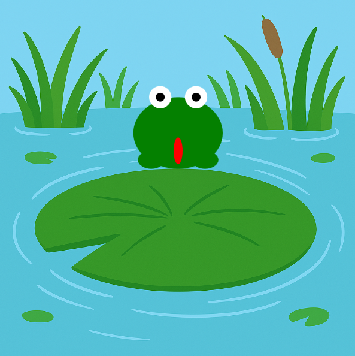

<h2 class="c-project-heading--task">Зроби так, щоб жабка впала назад вниз</h2>

\--- task ---

Використай гравітацію, щоб повернути свою жабку на землю після стрибка. 🪂

\--- /task ---

<h2 class="c-project-heading--explainer">Падіння з шиком</h2>

Зараз твоя жабка стрибає вгору і продовжує летіти. Давай повернемо її назад на землю! 🌍  
Ми скористаємося гравітацією, щоб поступово опустити її вниз і безпечно приземлити.

Ось як це працює:

- Поки `стрибок` увімкнено (`True`), ми додаємо `гравітацію` до `швидкості`
- Це змушує жабку сповільнюватися, а потім падати все швидше і швидше
- Коли жабка досягає землі, ми скидаємо її позицію та зупиняємо стрибок

<div class="c-project-code">
--- code ---
---
language: python
filename: main.py
line_numbers: true
line_number_start: 44
line_highlights: 46-50
---

    ```
    if стрибок:
        y += швидкість
        швидкість += гравітація
        if y >= 200:
            y = 200
            швидкість = 0
            стрибок = False
    ```

\--- /code ---

</div>

<div class="c-project-output">

</div>

<div class="c-project-callout c-project-callout--tip">

### Порада 🌟

Спробуй змінити значення `гравітації`. <br />
Більше число спричинить, що жабка падатиме швидше. <br />
Менше число зробить посадку твоєї жабки м’якшою! 🐸🌬️

</div>

<div class="c-project-callout c-project-callout--debug">

### Налагодження 🧰

Якщо твоя жабка ніколи не приземляється:<br />

- Переконайся, що `швидкість += гравітація` знаходиться всередині блоку `if стрибок:`<br />
- Перевір, чи використовуєш `y >= 200` як умову приземлення<br />
- Не забудь скинути `швидкість = 0` і `стрибок = False`

</div>