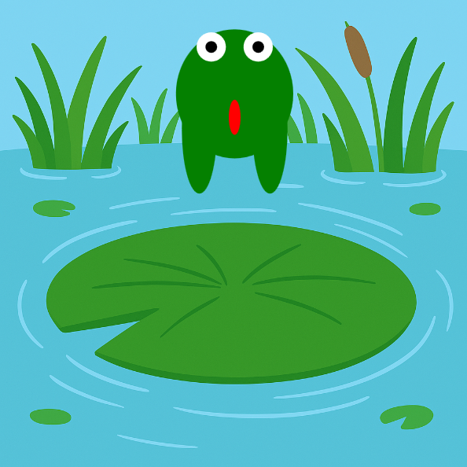

<h2 class="c-project-heading--task">Витягни ноги жаби</h2>

\--- task ---

Зроби так, щоб ступні жаби витягувалися, коли вона стрибає. 🐾

\--- /task ---

<h2 class="c-project-heading--explainer">Відштовхуйся потужніше!</h2>

Тепер давай витягнемо ноги жаби, коли вона стрибає.  
Ми змінимо **висоту** ступні, використовуючи ту саму змінну `stretch`.

Помнож `stretch` на число, щоб зробити рух ніг ще помітнішим.  
Спробуй `stretch * 2` або `stretch * 3`!

<div class="c-project-code">
--- code ---
---
language: python
filename: main.py
line_numbers: true
line_number_start: 23
line_highlights: 31-32
---

def draw():
global y, швидкість, стрибок
зображення(bg, 0, 0, ширина, height)
fill('green')

    ```
    stretch = 30 якщо стрибок інакше 0
    
    ellipse(x, y, 100, 80 + stretch)                     # тулуб
    ellipse(x - 30, y + 30, 30, 20 + stretch * 3)        # ліва нога
    ellipse(x + 30, y + 30, 30, 20 + stretch * 3)        # права нога
    ```

\--- /code ---

</div>

<div class="c-project-output">

</div>

<div class="c-project-callout c-project-callout--tip">

### Порада

Якщо ноги витягуються занадто сильно, спробуй помножити на менше число. <br />
Якщо використовувати `stretch * 2`, рух буде м’якший, ніж при `stretch * 3`.

</div>

<div class="c-project-callout c-project-callout--debug">

### Налагодження

Якщо ступні виглядають дивно:<br />

- Перевір, що ти додаєш `stretch * 3` до **висоти** кожної ступні<br />
- Двічі перевір, що позиції ніг все ще `x - 30` і `x + 30`

</div>